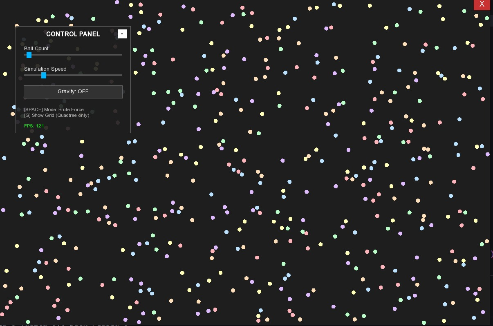

# Simulasi Partikel dengan menggunakan Brute Force dan QuadTree


 
*(Caption: Visualisasi kode saat dijalankan)*


<p align="justify">
Proyek ini adalah simulasi partikel 2D interaktif yang dibangun menggunakan C++ dan SFML. Tujuan utamanya adalah memvisualisasikan dan membandingkan performa antara metode deteksi tabrakan **Brute Force** dengan metode **Quadtree**.
<p>

---
## Fitur Utama

*   **Simulasi**: Mensimulasikan ratusan hingga ribuan partikel yang saling bertumbukan
*   **Dual Algorithm Mode**:
    *   **Brute Force $(O(N^2))$**: Metode yang mengecek semua kemungkinan pasangan bola satu sama lain.
    *   **Quadtree $(O(N \log N))$**: Metode yang mengoptimasi yang membagi area menjadi kuadran untuk mengurangi jumlah pengecekan secara drastis.
*   **Control Panel**: Berfungsi untuk mengatur jumlah bola, kecepatan, dan gravitasi.
  
---

## Struktur Kode

Kode ini ditulis dalam satu file (`main.cpp`) 

### 1. Struktur Data & Class

Berikut adalah komponen utama penyusun program:

#### A. Komponen Logika & Fisika
*   **`struct Ball`**:
    *   Merepresentasikan objek partikel.
    *   Menyimpan properti visual (`sf::CircleShape`) dan fisik (`sf::Vector2f velocity`).
*   **`struct Rect`**:
    *   Helper geometry untuk mendefinisikan area persegi (*Axis-Aligned Bounding Box*).
    *   Digunakan oleh Quadtree untuk menentukan apakah sebuah bola masuk dalam wilayahnya (`contains`) atau apakah wilayahnya bersinggungan dengan wilayah lain (`intersects`).
*   **`class Quadtree`**:
    *   Struktur data pohon spasial.
    *   **Logika Utama**: Membagi layar menjadi 4 node anak (NW, NE, SW, SE) jika kapasitas node penuh.
    *   **Fungsi `query()`**: Mengambil daftar bola potensial di area tertentu, sehingga program tidak perlu mengecek bola yang jauh.

#### B. Komponen User Interface (UI)
*   **`struct Button`**: Menangani rendering tombol dan deteksi klik mouse sederhana.
*   **`struct Slider`**: Mengonversi posisi mouse (x) menjadi nilai numerik (float) untuk mengatur parameter simulasi.

---

### 2. Implementasi Algoritma

Perbedaan utama performa terletak pada bagaimana program mendeteksi tabrakan di dalam *Main Loop*.

#### A. Algoritma Brute Force 
Dijalankan saat `useQuadtree = false`. 

```cpp
if (!useQuadtree) {
    for (size_t i = 0; i < balls.size(); ++i)
        for (size_t j = i + 1; j < balls.size(); ++j)
            solveBallCollision(balls[i], balls[j]);
}
```

#### Penjelasan:
Menggunakan **Nested Loop** (perulangan bersarang). Setiap bola $i$ dicek terhadap setiap bola $j$.

* **Kompleksitas**: $O(N^2)$
* **Analisis**: Jika ada 1.000 bola, sistem melakukan hampir **500.000 pengecekan per frame**. Ini penyebab penurunan FPS drastis pada jumlah partikel banyak.

#### B. Algoritma QuadTree 
Dijalankan saat `useQuadtree = true`. 

```cpp
else {
    // Tentukan batas area simulasi (seluruh layar)
    Rect boundary = {
        WINDOW_WIDTH / 2.0f, WINDOW_HEIGHT / 2.0f, 
        WINDOW_WIDTH / 2.0f, WINDOW_HEIGHT / 2.0f
    };
    Quadtree qt(boundary, 4); 

    // 1. Insert Phase: Memasukkan seluruh bola ke dalam tree
    for (size_t i = 0; i < balls.size(); ++i) qt.insert(i, balls);

    // 2. Query & Check Phase
    for (size_t i = 0; i < balls.size(); ++i)
    {
        std::vector<int> candidates;
        candidates.reserve(32); // Optimasi alokasi memori vector
        
        // Buat area pencarian di sekitar bola saat ini (Search Range)
        Rect range = {
            balls[i].shape.getPosition().x, 
            balls[i].shape.getPosition().y, 
            BALL_RADIUS * 2, BALL_RADIUS * 2
        }; 
        
        // Minta tree memberikan daftar bola di area
        qt.query(range, candidates);

        // Cek tabrakan hanya dengan bola kandidat (tetangga dekat)
        for (int j : candidates)
        {
            if (i < j) solveBallCollision(balls[i], balls[j]);
        }
    }
}
```
#### Penjelasan:
Menggunakan **Spatial Partitioning** (pembagian ruang). Bola dimasukkan ke dalam kuadran, dan sistem hanya mengecek tabrakan terhadap bola lain yang berada di kuadran yang sama (tetangga dekat).

Kompleksitas: **$O(N log N)$**

#### Analisis: 
Pada dasarnya, **QuadTree**  bisa dibilang adalah **Brute Force** dengan konsentrasi yang lebih kecil, sehingga jauh lebih efektif. Jika ada 1.000 bola, satu bola mungkin hanya mengecek 5-10 bola yang ada di sekitar. Total operasi turun drastis menjadi sekitar 10.000 pengecekan per frame (dibanding 500.000 pada Brute Force), membuat simulasi tetap lancar.

### 3. Implementasi Fitur Visual & Interaktif

Selain algoritma utama, proyek ini memiliki fitur visual dan antarmuka (UI) yang dibangun secara manual (*from scratch*) tanpa menggunakan library GUI eksternal.

#### A. Visualisasi Grid Quadtree (Recursive Rendering)
Fitur ini memungkinkan pengguna melihat bagaimana Quadtree membagi ruang secara *real-time*. Visualisasi dilakukan dengan menggambar batas (`boundary`) dari setiap node dalam tree.

Implementasi menggunakan metode **Rekursif**:
1.  Program menggambar kotak batas node saat ini.
2.  Jika node tersebut membelah diri (`divided == true`), fungsi akan memanggil dirinya sendiri untuk keempat anak node (NW, NE, SW, SE).
```cpp
// Cuplikan dari struct Quadtree
void draw(sf::RenderWindow& window)
{
    // Gambar boundary node saat ini (Garis Hijau)
    sf::RectangleShape rectShape;

    rectShape.setPosition(
        boundary.x - boundary.w, 
        boundary.y - boundary.h
    );
    
    rectShape.setSize({boundary.w * 2, boundary.h * 2});
    
    // Setting visual: transparan dengan outline hijau
    rectShape.setFillColor(sf::Color::Transparent);
    rectShape.setOutlineColor(sf::Color(0, 255, 0, 150)); 
    rectShape.setOutlineThickness(1.0f);
    
    window.draw(rectShape);

    // Panggilan Rekursif untuk anak-anak node
    if (divided)
    {
        nw->draw(window); 
        ne->draw(window);
        sw->draw(window); 
        se->draw(window);
    }
}
```
#### B. Custom UI System (Slider Logic)
Karena menggunakan `sf::Style::None (windowless)`, sistem input seperti Slider dibuat manual. Logika utamanya adalah Konversi Koordinat ke Data.

Slider mengubah posisi kursor mouse (pixel) menjadi nilai variabel **(float/int)** untuk mengatur jumlah bola atau kecepatan simulasi.

```cpp
// Cuplikan dari struct Slider
void updateValueFromPos(float mouseX)
{
    // Menghitung rasio posisi thumb terhadap track (0.0 sampai 1.0)
    float ratio = (mouseX - trackX) / trackW;
    
    // Konversi rasio ke nilai aktual (Linear Interpolation)
    currentValue = minValue + ratio * (maxValue - minValue);

    updateThumbVisual(); 
}
```

#### C. Window & Panel Dragging
Aplikasi ini tidak memiliki title bar bawaan OS. Fungsi drag-and-drop diimplementasikan dengan menangkap selisih posisi mouse (dragOffset) saat klik terjadi.

Logika ini diterapkan pada dua objek:

1. **Main Window**: Menggeser seluruh aplikasi di layar monitor.

2. **Control Panel**: Panel menu yang bisa dipindah-pindah agar tidak menutupi area simulasi.

### 4. Implementasi Logika Fisika Partikel (Ball Logic)

Simulasi ini menggunakan hukum fisika dasar untuk mengatur pergerakan dan interaksi antar bola agar terlihat realistis.

#### A. Struktur Objek Bola
Setiap bola direpresentasikan oleh `struct Ball` yang memiliki dua komponen utama:
1.  **Visual**: `sf::CircleShape` (menangani posisi, warna, dan jari-jari).
2.  **Fisika**: `sf::Vector2f velocity` (vektor kecepatan X dan Y).

#### B. Pergerakan & Pantulan Dinding
Pergerakan bola menggunakan metode integrasi Euler sederhana: *Posisi Baru = Posisi Lama + Kecepatan*.

Ketika bola menyentuh batas layar (Window), arah kecepatannya dibalik (dikalikan -1) untuk menciptakan efek pantulan.

```cpp
// Logic di dalam Main Loop
ball.shape.move(ball.velocity * speedMult); // Update Posisi

sf::Vector2f pos = ball.shape.getPosition();

// Cek Tabrakan Dinding Kiri/Kanan
if (pos.x < BALL_RADIUS || pos.x > WINDOW_WIDTH - BALL_RADIUS) {
    ball.velocity.x = -ball.velocity.x; // Balik arah horizontal
}

// Cek Tabrakan Dinding Atas/Bawah
if (pos.y < BALL_RADIUS || pos.y > WINDOW_HEIGHT - BALL_RADIUS) {
    ball.velocity.y = -ball.velocity.y; // Balik arah vertikal
}
```
#### C. Respon Tumbukan (Elastic Collision)
Ketika dua bola terdeteksi bertabrakan (jarak < diameter), sistem melakukan dua hal:

1.  **Static Resolution**: Memisahkan kedua bola agar tidak saling menempel atau tumpang tindih (*overlap*).
2.  **Dynamic Resolution**: Menghitung vektor pantulan menggunakan prinsip kekekalan momentum dan energi kinetik (tumbukan lenting sempurna).

Kode memproyeksikan kecepatan bola ke dalam vektor **Normal** (arah tabrakan) dan **Tangent** (garis singgung). Pertukaran momentum hanya terjadi pada komponen Normal.

```cpp
// Cuplikan fungsi solveBallCollision
void solveBallCollision(Ball& b1, Ball& b2)
{
    // 1. Hitung Vektor Normal & Jarak
    sf::Vector2f delta = pos1 - pos2;
    float dist = std::sqrt(distSq);
    sf::Vector2f normal = delta / dist;

    // 2. Static Resolution (Cegah Overlap)
    float overlap = (BALL_RADIUS * 2.0f) - dist;
    b1.shape.move(normal * (overlap * 0.5f));
    b2.shape.move(-normal * (overlap * 0.5f));

    // 3. Hitung pemantulan
    float tx = -normal.y; float ty = normal.x;
    float dpTan1 = b1.velocity.x * tx + b1.velocity.y * ty;
    float dpTan2 = b2.velocity.x * tx + b2.velocity.y * ty;
    float dpNorm1 = b1.velocity.x * normal.x + b1.velocity.y * normal.y;
    float dpNorm2 = b2.velocity.x * normal.x + b2.velocity.y * normal.y;

    b1.velocity.x = tx * dpTan1 + normal.x * dpNorm2;
    b1.velocity.y = ty * dpTan1 + normal.y * dpNorm2;
    b2.velocity.x = tx * dpTan2 + normal.x * dpNorm1;
    b2.velocity.y = ty * dpTan2 + normal.y * dpNorm1;
}
```
#### D. Gravitasi & Gesekan
Fitur gravitasi (`Gravity: ON`) menambahkan akselerasi konstan ke arah bawah (`velocity.y`). Saat bola memantul di lantai dalam mode gravitasi, energi dikurangi sedikit (*damping*) agar bola perlahan berhenti memantul, mensimulasikan gesekan udara dan ketidaksempurnaan elastisitas.

```cpp
if (gravityBtn.state) {
    ball.velocity.y += 0.15f * speedMult; // Gravitasi menarik ke bawah
}

// Saat menyentuh lantai
if (pos.y > WINDOW_HEIGHT - BALL_RADIUS && gravityBtn.state) {
    ball.velocity.y = -std::abs(ball.velocity.y) * 0.70f; 
    // Hilang energi 30% (Damping)
    ball.velocity.x *= 0.96f; // Gesekan lantai (memperlambat gerak)
}
```
### 5. Kesimpulan

<p align="justify">
Proyek ini secara komprehensif mendemonstrasikan peran vital struktur data dalam optimasi simulasi komputer real-time, di mana implementasi metode <strong>Quadtree</strong> terbukti jauh lebih unggul dibandingkan pendekatan <strong>Brute Force</strong> khususnya saat menangani jumlah partikel yang masif ($N > 800$). Melalui penurunan kompleksitas algoritma dari $O(N^2)$ menjadi rata-rata $O(N \log N)$, simulasi mampu mempertahankan performa tinggi (<em>High FPS</em>) dengan mengurangi beban komputasi secara signifikan. Selain aspek performa, pengembangan <em>physics engine</em> dan sistem antarmuka (UI) yang dibangun sepenuhnya secara manual (<em>from scratch</em>) menggunakan C++ dan SFML menegaskan pemahaman mendalam mengenai konsep pemrograman <em>low-level</em>, manajemen memori, serta vektor matematika, menyimpulkan bahwa penguasaan teknik <strong>Spatial Partitioning</strong> adalah solusi fundamental dalam mengatasi limitasi komputasi pada aplikasi interaktif berskala besar.
</p>